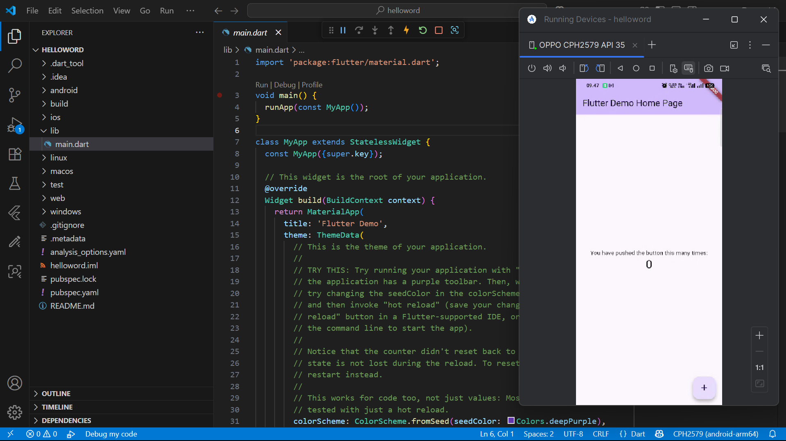
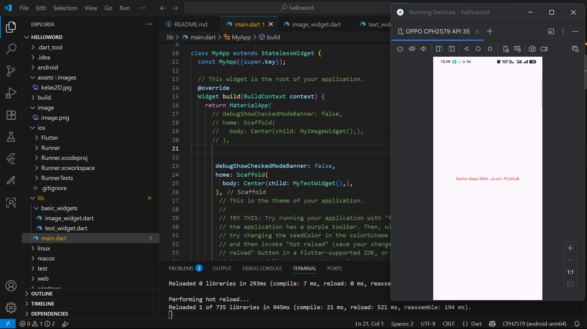
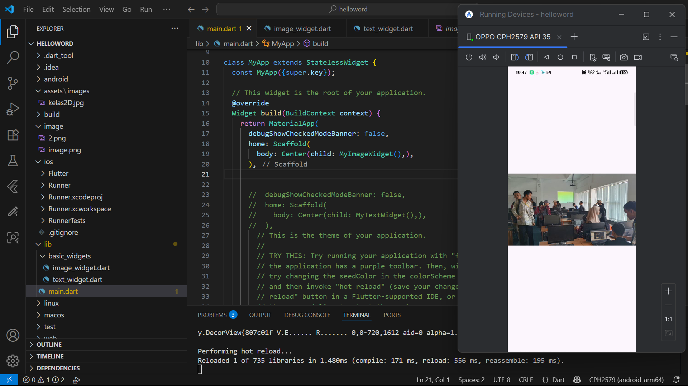

# Flutter Fundamental Part 1

Laporan praktikum pada website [https://flutter-codelabs.netlify.app/](https://flutter-codelabs.netlify.app/)

## Membuat Repository GitHub dan Laporan Praktikum
Hasil dari menjalankan project helloworld:  

## Penerapan Widget Dasar
Penerapan Penulisan Text:  

Menambahkan Gambar:  
